### This repository has been developed by:
* [Federica Botta](https://www.linkedin.com/in/federica-botta-8629391b3/)
* [Simone Colombara](https://www.linkedin.com/in/simone-colombara-a4a430167/)
* [Michele Di Sabato](https://www.linkedin.com/in/michele-di-sabato/)

# Calibration of the monodomain model coupled with the Rogers-McCulloch model for the ionic current: design of a protocol for impulse delivery from an ATP device.

**Before running the code contained in this repository, please have a look at [WARNING.md](WARNING.md).**

## Theoretical framework:
The framework for this project is the following: the normal diffusion of the potential in the heart is hindered by a [re-entry](https://www.youtube.com/watch?v=yLI4yj1TZhc) of the signal, possibly caused by scar tissue in specific areas of the heart. This problem leads to some complications, which could be fatal. In order to restore the normal diffusion of the potential through the affectted region, an Anti-Tachycardia Pacing (ATP) device is inserted: its purpose is to deliver an impulse at a specific time (from now on called *impulse time*) and with a specific duration (from now on called *impulse duration*) to avoid the re-entry. The role of the impulse is to reset the ECG and the device checks the effectiveess of the shock tracking the ECG in a certain time interval after the shock. This period is called *tracking window* and it lasts from 600 to 800 milliseconds. The impulse timing can be within 450 and 525 milliseconds and there is no bound a priori on the impulse duration.

We are given 
* three ECG signal observed for some milliseconds of three different patients;
* a numerical solver to compute an approximation of an ECG to solve the [monodomain model](https://en.wikipedia.org/wiki/Monodomain_model), couple with the [Rogers-McCulloch model](https://ieeexplore.ieee.org/document/310090?reload=true) for the ionic current.

## Goals:
We want to:
* calibrate patient-specific parameter $\nu_2 \in (0.0116, 0.0124)$ ms for the Rogers-McCulloch model;
* find the *best* values for the timing (t<sup>best</sup>) and duration (Δt<sup>best</sup>) of the impulse delivered by the ATP;  

We quantify the effectiveness of pair (t<sup>best</sup>, Δt<sup>best</sup>) in terms of the ability of the resulting impulse to:
1. annihilate the ECG in the tracking window 
2. preserve the device's battery as long as possible by minimizing the duration of the impulse 

## Calibration for ν<sub>2</sub>:
Before working on the ATP device, we need to tune hyperparameter $\nu_2$:
$$\nu_2^{best} = argmin_{\nu_2} \|\|u(t) - u_{exact}(t)\|\|_{L^2(0, 450)ms}$$
To do so we used a modifed version of a naive random search algorthm, which we called *Adaptive Random Search* (see page 2, Section 2.1 of our [report](report.pdf)).

**Remarks:**
1. The ECG provided are noisy: they were first denoised using a low-pass bandpass filter called [Butterworth filter](https://en.wikipedia.org/wiki/Butterworth_filter). The results are shown in the following plots:

| Patient 1 |  Patient 2 |  Patient 3 |
:-------------------------:|:-------------------------:|:-------------------------:
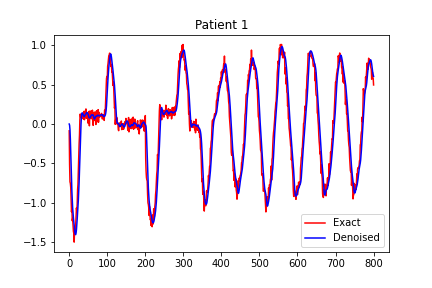  | 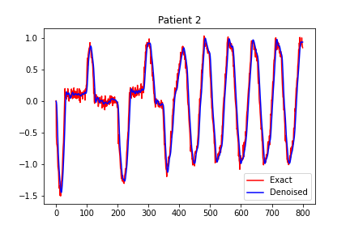 | 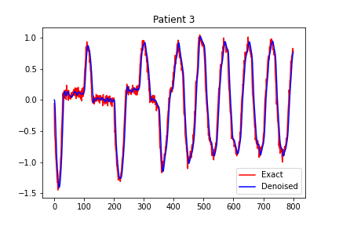

2. For each iteration, the sampling of ν<sub>2</sub> is repeated until it falls within its bounds.
3. The variance of the Gaussian from which we sample ν<sub>2</sub> decreases according to the number of iterations.
4. We used 20 iterations: for each iteration we need to compute the solution of the monodomain problem coupled with the model for the ionic current, which is quite costly.

The following plot shows the results of the calibration:

| Patient 1 |  Patient 2 |  Patient 3 |
:-------------------------:|:-------------------------:|:-------------------------:
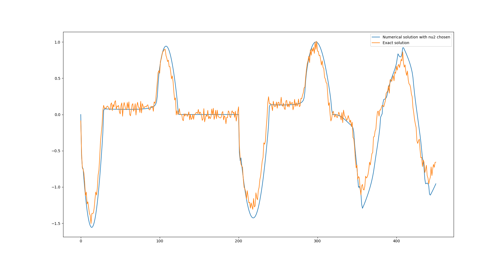  | 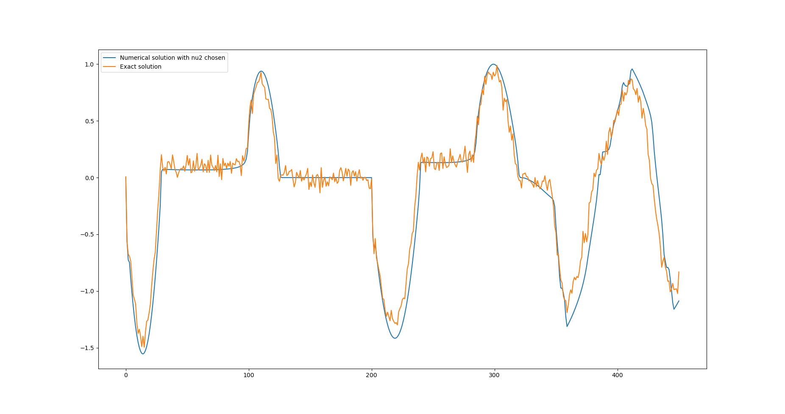 | 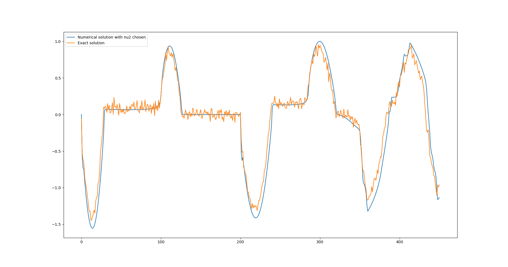

In particular, this plot showcases the exploration for paramete $\nu_2$:

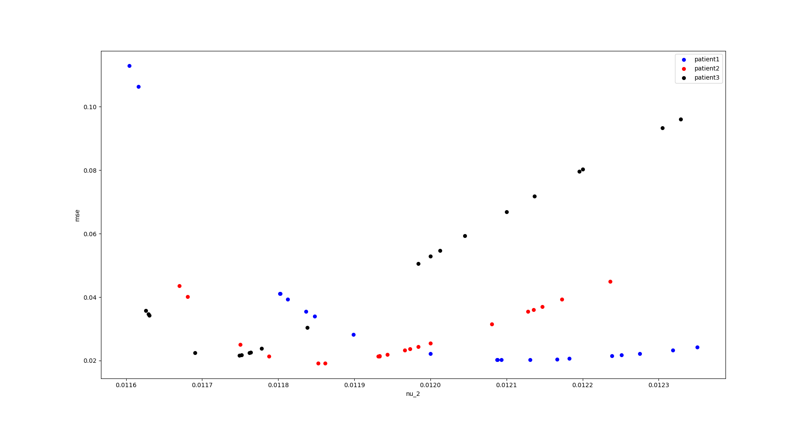

## Calibration for (t<sup>best</sup>, Δt<sup>best</sup>)
Calibrating t<sup></sup> and Δt<sup></sup> using [grid search](https://towardsdatascience.com/grid-search-for-model-tuning-3319b259367e) or even our own version of a Naive Random Search (which hwe called Adaptive Random Search) is too costly, since for each possible couple (t<sup></sup>, Δt<sup></sup>) we would need to solve the monodomain problem for each patient. 

To avoid wasting time in useless evaluations, we relied on [Bayesian Otimization](https://arxiv.org/abs/1807.02811), in particular on [this](https://github.com/fmfn/BayesianOptimization) opensource python library, which needs to be installed to run the code contained in this repository:

```
pip install bayesian-optimization
```

The Bayesian Optimization algorithm is specifically designed to minimize the number of evaluations of the objective function, which in our case is the L2 norm of the ECG signal of each patient in the tracking window (600, 800) milliseconds. This approach is particularly useful when the objective function is expensive to be evaluated, as in our case.

**Remarks:**
1. Bayesian Optimization is implemented to solve a **maximization** problem, so to use this library for our purposes[^1], we used the opposite of the L2 norm of the numerical ECG, hence the "minus" sign in the objective function.
2. To take into account also the battery duration, we decided to add to the loss function a term which is proportional to the square of the duration of the impulse, to try to be more conservative with respect to the battery consumption.
3. The ATP device comes into play only after 450 milliseconds, therefore the ECG until the 450-th millisecond is always the same. Still, the numerical solver (which relies on an iterative procedure) needs to compute the solution from the very beginning. To avoid wasting time on simulating the first 450 milliseconds, we computed the ECG once and for all amd saved it: at each step of the Bayesian Optimization algorithm, we simply load the numerical ECG until the 450-th millisecond and go on from there using the solver. **Please look at [WARNING.md](WARNING.md) for more details.**

### Loss function:
We used two typed of loss function:
1. $||\hat{u}||_{L^2(600, 800)ms} + \lambda \Delta t$
2. $||\hat{u}||_{L^2(600, 800)ms} + \lambda (\Delta t)^2$

[^1]: We want to reset the ECG, therefore we are dealing with a minimization task.

where 
* $u$ is the numerical ECG.
* $\Delta t$ is the ATP impulse duration.
* $\lambda$ is a term which quantifies the fact that higher values of $\Delta t$ should be avoided, since they undemine the device's battery.

Moreove, we noticed that by restricting the bounds for $\Delta t$, we were still able to find optimal results. FOr this reason we restricted the bounds for $\Delta t$.

We decided to use:

| item | Patient 1 |  Patient 2 |  Patient 3 |
:-------------------------:|:-------------------------:|:-------------------------:|:-------------------------:
|**Loss** | $\|\|\hat{u}\|\|_{L^2(600, 800)ms}+(\Delta t)^2$ | $\|\|\hat{u}\|\|_{L^2(600, 800)ms}+(\Delta t)^2$ | $\|\|\hat{u}\|\|_{L^2(600, 800)ms}+0.001\Delta t$
|**$\lambda$** | 1  | 1 | 0.001
| **t bound** | (0, 2) ms  | (0, 2) ms | (0, 8) ms

**Remarks:**
1. We needed to tread carefully with parameter $\lambda$: if we penalized excessively longer impulse durations, the overall loss function was not able to reset the ECG in the tracking window. This trade-off forced us to cope with higher impulse durations, especially for patient 3.
1. We realized that it was not necessary to annihilate the ECG in the *whole* tracking window, hence we tried to restrict the $L^2$ norm of the ECG in a subset of the tracking window[^2].
1. The calibration for the third patient was the one which consistently resulted in higher values for $\Delta t$, therefore we decided to focus on finding better values for the impulse duration, rather than exploring the space of possible impusle timings. We therefore restricted the bounds for the impulse timing of patient 3 from (450, 600)ms to (509, 513)ms. The choice for these values was motivated by the following plot:

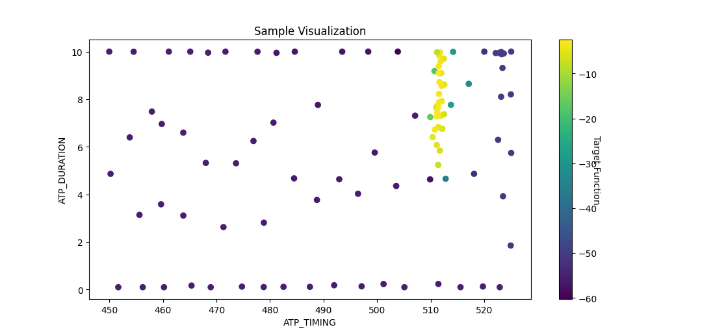

[^2]: Basically this means that, being the tracking window within 600 and 800 milliseconds, with this choice the ECG was not exaclty zero from 600 milliseconds on, but from, from example, 750 milliseconds. This is still condiered an effective impulse.

## ECG reset:
The following plots showcase the ability of our impulse delivery protocol to reset the ECG in the tracking widow for all three patients:

| Patient Number | Impulse delivery timing | Impulse duration |Numerical ECG |
:-----------|:---------:|:---------:|:---------:
*Patient 1* | 484.707 ms | 2.697 ms | 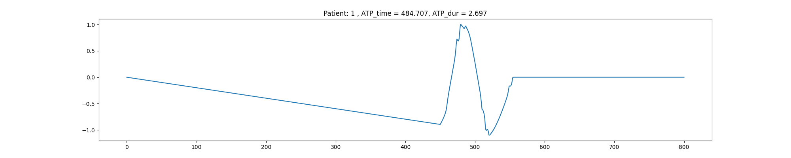
*Patient 2* | 501.435 ms | 2.804 ms | 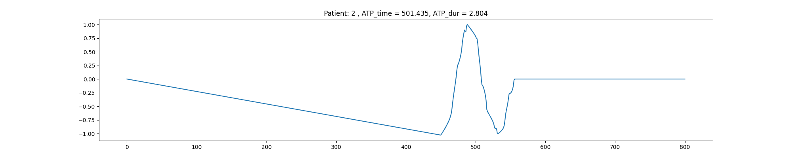
*Patient 3* | 511.579 ms | 5.038 ms | 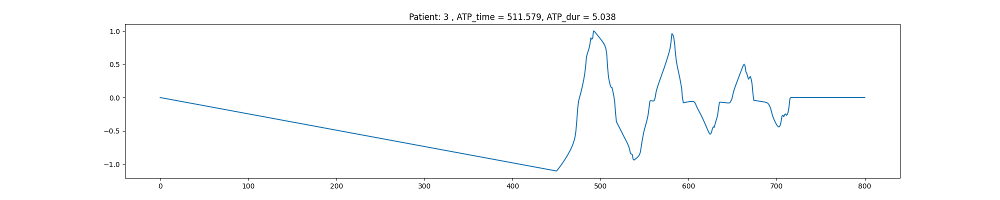 


